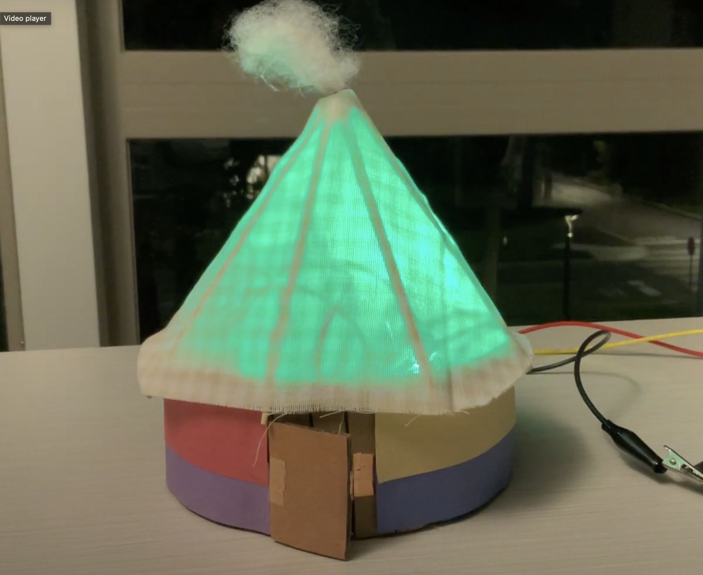

# Gentle Ger Getaway

## Welcome! This is the code for an interactive nightlight I built using Arduino and some basic hardware components:
- Photoresistors
- DIY Lofi Potentiometer
- RBG LEDs
- Copper Tape
- and more!

### Background and Theme
This nightlight was inspiried by the ger - a transportable housing unit traditionally used by the nomadic Mongolian people. It is a beautiful structure and typically includes a stove in the middle. 
Therefore, the ger not only emits light, it also represents home, warmth, and comfort - themes that are central and representative of a nightlight.

### Interactive Modes
This interactive nightlight includes 3 modes:
1. RGB Crossfade + Photosensitivity: The nightlight's LED will crossfade across the full, rainbow color spectrum. It also will adjust the brightness to be inversely proportional to the light levels 
of its environment (using the photoresistor). Darker room = brighter LED, brighter room = darker LED.
2. Lofi Color Picker: The user may select the desired color of the nightlight using the DIY potentiometer I build using graphite and paper. Sliding the picker across the strip will trigger 1 of 6 possible color options (please see demo).
3. Party Mode! 🎉: (My personal favorite) When the parents close the door and leave, that's when the party begins! Please close the door (lofi button build with copper tape) to trigger party mode!

## Video Demo + Process
Please see the following link to view a video demo of the Gentle Ger Getaway in action!
[Video Demo](https://drive.google.com/file/d/1TzzSgzxz77ld8LMIPySECpUAymfuOo-t/view?usp=share_link)

Visit this link to see the ideation and build process:
[Ideation + Build](https://docs.google.com/presentation/d/1uNTaUmqj0x0-Q2Feiwg5e_HlgvOd46LTBriQuXS8OVU/edit?usp=share_link)

\

